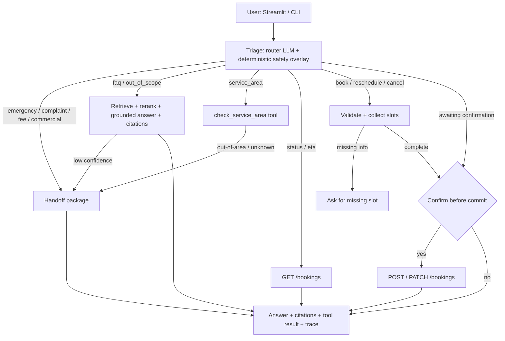

# Meridian Home Services - AI Contact-Center Assistant (prototype)

A grounded, agentic assistant for a mid-market home-services company. It answers policy/FAQ
questions strictly from the provided knowledge pack (with citations), checks ZIP service-area
eligibility, books/reschedules/cancels visits against a mock Booking API (with input validation
and an explicit confirmation step), and cleanly hands off to a human when confidence is low, the
request is out of scope, or required info is missing.

Built from scratch with **LangGraph + LangChain**, **OpenAI** models, **Chroma** + a local
**cross-encoder** reranker, a **FastAPI** mock Booking API, a **Streamlit** chat UI, and a
**custom + RAGAS** evaluation harness.

---

## What it can do

- **Grounded answering** over the 11 knowledge docs (hours, pricing, warranty, cancellation,
  payments, emergencies, booking FAQ) with **inline source citations** and a hard "answer only
  from context" guardrail.
- **Service-area eligibility**: deterministic ZIP -> (covered / sub-contracted / pending /
  not-covered / out-of-area) lookups parsed from the coverage grids.
- **Agentic booking flow**: collect + validate fields, check eligibility, **confirm before
  committing**, then call `POST` / `PATCH /bookings`; plus status and ETA lookups via `GET`.
- **Safe human-handoff** with a structured package (reason, recommended route, collected info,
  transcript) for emergencies, fee disputes, complaints, commercial accounts, out-of-area ZIPs,
  out-of-scope questions, low confidence, and API errors.

---

## Architecture



Two ideas do the heavy lifting:

1. **Structured data is handled deterministically, not by the LLM.** ZIP ranges
   (`22030-22039`), the 60-day window, and cancellation fees are parsed/enforced in code. RAG is
   used only for natural-language policy text. This is what makes eligibility and fees trustworthy.
2. **Confidence is gated on embedding similarity, ordering on the cross-encoder.** The cross-
   encoder (ms-marco MiniLM) is great for *ordering* but its absolute scores are poorly calibrated
   (it scored a correct chunk 0.03 on one phrasing and 0.99 on another). Embedding cosine cleanly
   separates relevant (~0.38-0.69) from out-of-scope (~0.07-0.13), so the low-confidence handoff
   gate uses that, while the final ranking blends both signals.

---

## Quickstart

Prerequisites: Python 3.10+ and the `OPENAI_API_KEY` already present in `.env`.

```bash
# 1. Install (creates .venv and installs the package + deps)
make install            # or: python3 -m venv .venv && ./.venv/bin/pip install -e .

# 2. Build the vector index (extract PDFs -> chunk -> embed -> Chroma)
make ingest

# 3. Start the mock Booking API (terminal 1)
make api                # http://localhost:8000  (docs at /docs)

# 4a. Run the web UI (terminal 2)
make app                # http://localhost:8501

# 4b. ...or chat in the terminal
make cli                # add --debug for the per-turn agent trace

# 5. Evaluate
make eval               # full: retrieval + answer + action + handoff + RAGAS
make eval-quick         # skips RAGAS (faster)

# 6. Unit tests (no network)
make test
```

Configuration lives in `.env` (see `.env.example`): chat/embedding models, reranker choice,
retrieval `top_k`/`top_n`, the confidence floor, the Booking API URL/token, and `DEMO_DATE`
(set this to e.g. `2026-01-20` to make date-relative demos reproducible).

The first retrieval call downloads the ~90 MB cross-encoder from Hugging Face (free, no token)
and caches it. Set `RERANKER=llm` to rerank with OpenAI instead, or `RERANKER=none` to skip it.

---

## Key design decisions (and why)

- **LangGraph** for orchestration. The task is an explicit, auditable, multi-step flow with intent
  routing, tool calls, a mandatory confirm-before-write gate, and a handoff branch. A state graph
  models this far more safely than a free-form ReAct loop. Conversation state persists across
  turns via a checkpointer, which is how slot-filling and confirmation work. (I implemented the
  confirmation gate as explicit persisted state rather than LangGraph's `interrupt()` for
  robustness across the UI, CLI, and eval harness - the requirement is "confirm before commit",
  which this satisfies.)
- **pdfplumber** for extraction. Pure-Python, strong table support. The coverage grids use a
  symbol font where a check renders as the glyph `3` and a cross as `7`; `normalize_coverage_cell`
  maps these (and `Sub-contracted` / `Pending`) and is unit-tested against known rows.
- **Per-document chunking.** One chunk per FAQ Q&A, per branch's hours, per county's coverage,
  per pricing section - so a single retrieved chunk usually fully answers a question. 60 chunks
  total. Each carries `source_file / doc_title / section / version` for citations.
- **Chroma** (local, persistent, free) with **OpenAI `text-embedding-3-large`**. Cosine space.
- **Cross-encoder rerank** (`cross-encoder/ms-marco-MiniLM-L-6-v2`, local/free) for ordering,
  with embedding-similarity confidence gating (see Architecture).
- **OpenAI `gpt-4.1`** at `temperature=0` for the router (structured output), grounded answering,
  and the eval judge. Chosen over the `gpt-5.x` family because grounded answering wants
  deterministic `temperature=0` and rock-solid tool/structured-output support; swappable via
  `OPENAI_CHAT_MODEL`.
- **Mock Booking API as a real FastAPI service** (not in-process) so the agent makes genuine HTTP
  calls; swapping in the real internal API is a one-line base-URL change.

---

## Grounding and guardrails

- The answer prompt forbids outside knowledge; if the sources do not support an answer the model
  returns `answerable=false` and the agent hands off instead of guessing.
- A **low-confidence handoff** fires when the top embedding similarity is below
  `MIN_RETRIEVAL_SCORE` (0.25).
- **Sensitive intents never reach the answerer**: a deterministic, high-precision keyword overlay
  catches active emergencies (so safety never depends solely on the LLM) and backs up the router
  on fee disputes / complaints / commercial; these route straight to handoff.
- **No write without confirmation**: `POST` / `PATCH` only run in the `confirm` node after an
  explicit "yes". This is asserted in the eval ("confirm-before-commit").
- Eligibility, fees, and the 60-day window are deterministic; the Booking API validates again
  (defense in depth) and returns 4xx on bad input.

---

## Evaluation

`eval/testset.yaml` has 34 cases seeded from the 20 example messages and extended with FAQ
variants, more ZIPs, booking edge cases, and out-of-scope probes. `eval/run_eval.py` scores four
dimensions and writes `eval/results/report.md` + `report.json`.

**Latest results** (`gpt-4.1`, `text-embedding-3-large`, cross-encoder):

| Dimension | Result |
|---|---|
| Retrieval (16 RAG cases) | hit@1 **1.0**, hit@3 **1.0**, MRR **1.0**, recall@8 **1.0** |
| Answer keyword assertions | **100% (25/25)** |
| LLM-judge correctness / groundedness | **~94% (17/18)** |
| Action correctness | **100% (5/5)** |
| Confirm-before-commit | **100% (3/3)** |
| Handoff routing | **100% (34/34)** |
| RAGAS | faithfulness **0.93**, answer relevancy **0.75**, context precision **0.98**, context recall **0.97** |

Notes: the LLM judge is mildly non-deterministic even at `temperature=0` (it occasionally marks a
correct answer wrong); keyword assertions + RAGAS faithfulness are the stricter signals. RAGAS
answer-relevancy (~0.75) is expected since our answers are deliberately terse.

---

## Repository layout

```
src/meridian/
  config.py                 # env-driven settings (models, thresholds, API url, demo clock)
  ingestion/                # pdf_extract.py, chunkers.py, build_index.py
  knowledge/service_area.py # deterministic ZIP -> coverage index (+ chunks)
  retrieval/                # retriever.py (Chroma + rerank + confidence), citations.py
  api/mock_booking_api.py   # FastAPI mock of the Booking API spec
  booking_client.py         # httpx client used by the agent
  agent/                    # state, prompts, router, tools, handoff, graph (LangGraph)
  app/streamlit_app.py      # chat UI
  cli.py                    # terminal chat
eval/                       # testset.yaml, run_eval.py, results/
tests/                      # extraction, service-area, booking-API + fee logic
files/                      # the provided knowledge pack (PDFs)
docs/                       # PATH_TO_PRODUCTION.md, booking_api_spec.md (maintained API spec)
```

---

## Assumptions

- OpenAI usage is unconstrained (per the brief); everything else is free / local (Chroma,
  pdfplumber, the MiniLM cross-encoder via free HF download, FastAPI, Streamlit, RAGAS).
- The Booking API is fictional, so a local mock stands in for it, seeded with the booking IDs the
  example messages reference (`BK-00391042`, `BK-00483921`, `BK-00512883`).
- "Today" defaults to the system date; set `DEMO_DATE` for reproducible date-relative demos.
- A new booking needs a name + phone (or a `customer_id`); the demo does not authenticate users.

## Data-quality findings (surfaced, not hidden)

- **Coverage grids use a symbol font** (check = `3`, cross = `7`); mishandling this silently
  inverts eligibility. Handled and unit-tested.
- **No South-region service-area doc exists**, although 5 South branches appear in the hours doc.
  South ZIPs are therefore unverifiable from the pack and correctly resolve to out-of-area /
  Branch-Manager handoff (we do not fabricate coverage).
- **ZIP 22046 (Falls Church) is used as a bookable address in example message #3 but is not listed
  in the North coverage doc** (Fairfax is `22030-22039, 22041-22044`). The assistant strictly
  follows the doc and flags it for spot-approval; this is captured as eval case
  `booking_create_22046_discrepancy`.

## Debugging methodology

Built bottom-up with a verification gate at each layer before moving on:
1. Dumped raw pdfplumber output first to *see* how glyphs/tables actually extract (this revealed
   the `3`/`7` symbol fonts and the merged company/type header line) rather than guessing.
2. Validated the deterministic ZIP index against hand-checked rows before indexing anything.
3. Smoke-tested retrieval and the full agent on representative prompts; used the eval harness as a
   regression net. The eval immediately caught (a) emergency false-positives from loose keywords
   ("flood", "emergency" in FAQ questions), (b) the cross-encoder mis-calibration causing false
   low-confidence handoffs, and (c) a notes-filter regression that dropped the EcoPower referral -
   each fixed and re-run to green.

## Deliberately left out

- Real telephony/email ingestion (text prototype with a `channel` field), user auth/accounts, a
  persistent DB (the mock store is in-memory), streaming responses, fine-tuning, multi-language,
  and per-branch policy variants (discussed in `docs/PATH_TO_PRODUCTION.md`).

See `docs/PATH_TO_PRODUCTION.md` for hardening, monitoring, and scaling to all 11 branches.
