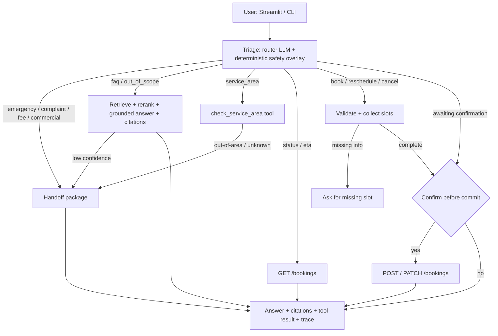

# Meridian Home Services - AI Contact-Center Assistant

A prototype assistant for a mid-market home-services company's contact center. It answers policy
and FAQ questions from the company's knowledge pack (and cites them), checks whether a ZIP falls in
the service area, books, reschedules, and cancels visits through a mock Booking API, and pulls in a
human when it isn't confident, the request is out of scope, or it's missing something it needs.

Under the hood it uses LangGraph and LangChain with OpenAI models, Chroma for vector search, a local
cross-encoder for reranking, a FastAPI service standing in for the real Booking API, a Streamlit chat
UI, and an evaluation harness built from custom checks plus RAGAS.

## What it does

- Answers questions about hours, pricing, warranty, cancellations, payments, emergencies, and
  booking, using only the 11 knowledge documents and citing what it used. If the docs don't cover
  something, it says so instead of guessing.
- Checks whether a ZIP is in the service area. That lookup is deterministic and returns one of
  covered, sub-contracted, pending, not-covered, or out-of-area, read straight from the coverage
  grids.
- Books, reschedules, and cancels visits. It collects and validates the fields it needs, checks
  eligibility, confirms with the customer before writing anything, then calls `POST`/`PATCH /bookings`.
  Status and ETA come back from `GET /bookings`.
- Hands off to a human when it should. Emergencies, fee disputes, complaints, commercial accounts,
  out-of-area ZIPs, out-of-scope questions, low confidence, or an API error each produce a structured
  handoff package: the reason, a suggested route, the info gathered so far, and the transcript.

## Architecture



A couple of decisions shape everything else.

The first is that structured data never goes through the model. ZIP ranges like `22030-22039`, the
60-day booking window, and the cancellation-fee schedule are parsed and enforced in code; the LLM
only ever sees free-form policy text. That's the part that makes eligibility and fee answers
something you can actually trust.

The second is that "is this relevant enough to answer?" and "which chunk is best?" are answered by
different signals. The ms-marco MiniLM cross-encoder ranks candidates well, but its absolute scores
aren't calibrated at all. On one run it scored the same correct chunk 0.03 for one phrasing and 0.99
for another. Embedding cosine similarity, by contrast, cleanly separates relevant chunks (roughly
0.38-0.69) from out-of-scope ones (roughly 0.07-0.13). So the low-confidence handoff gate keys off
cosine similarity, and the final ordering blends the cross-encoder score with it.

## Quickstart

You'll need Python 3.10+ and an `OPENAI_API_KEY` in `.env`.

```bash
# 1. Install (creates .venv and installs the package + deps)
make install            # or: python3 -m venv .venv && ./.venv/bin/pip install -e .

# 2. Build the vector index (extract PDFs -> chunk -> embed -> Chroma)
make ingest

# 3. Start the mock Booking API (terminal 1)
make api                # http://localhost:8000  (docs at /docs)

# 4a. Run the web UI (terminal 2)
make app                # http://localhost:8501

# 4b. ...or chat in the terminal
make cli                # add --debug for the per-turn agent trace

# 5. Evaluate
make eval               # full: retrieval + answer + action + handoff + RAGAS
make eval-quick         # skips RAGAS (faster)

# 6. Unit tests (no network)
make test
```

Everything configurable lives in `.env` (copy `.env.example` to start): the chat and embedding
models, the reranker choice, retrieval `top_k`/`top_n`, the confidence floor, the Booking API URL and
token, and `DEMO_DATE`. Set `DEMO_DATE` (e.g. `2026-01-20`) when you want date-relative demos to be
reproducible.

The first retrieval call downloads the cross-encoder (about 90 MB) from Hugging Face and caches it;
it's free and needs no token. If you'd rather not run it, set `RERANKER=llm` to rerank with OpenAI or
`RERANKER=none` to skip reranking entirely.

## Design decisions

- **LangGraph for orchestration.** This is an explicit, auditable, multi-step flow: route the intent,
  call tools, force a confirmation before any write, and branch off to a handoff. A state graph fits
  that much better than a free-form ReAct loop. State persists between turns through a checkpointer,
  which is what makes slot-filling and confirmation work across messages. I kept the confirmation gate
  as explicit persisted state rather than LangGraph's `interrupt()` so it behaves identically in the
  UI, the CLI, and the eval harness.
- **pdfplumber for extraction.** Pure Python and good with tables. The coverage grids use a symbol
  font where a check comes through as the glyph `3` and a cross as `7`, so `normalize_coverage_cell`
  maps those (along with `Sub-contracted` / `Pending`) and is unit-tested against known rows.
- **Per-document chunking.** One chunk per FAQ answer, per branch's hours, per county's coverage, and
  per pricing section, so a single retrieved chunk usually answers the whole question. That comes to
  about 60 chunks, each tagged with `source_file`, `doc_title`, `section`, and `version` for citations.
- **Chroma with `text-embedding-3-large`.** Local, persistent, free, cosine space.
- **Cross-encoder reranking** (`cross-encoder/ms-marco-MiniLM-L-6-v2`, local and free) for ordering,
  with the cosine-similarity confidence gate described above.
- **`gpt-4.1` at `temperature=0`** for routing (structured output), grounded answering, and the eval
  judge. I chose it over the gpt-5.x models because grounded answering wants deterministic output and
  solid tool/structured-output support. It's swappable through `OPENAI_CHAT_MODEL`.
- **The mock Booking API is a real FastAPI service**, not an in-process stub, so the agent makes
  genuine HTTP calls. Pointing it at the real internal API would be a one-line base-URL change.

## Grounding and guardrails

- The answering prompt is limited to the retrieved sources. If they don't support an answer, the model
  returns `answerable=false` and the agent hands off rather than improvising.
- A low-confidence handoff fires when the top embedding similarity drops below `MIN_RETRIEVAL_SCORE`
  (0.25).
- Sensitive messages never reach the answerer. A small, high-precision keyword check catches active
  emergencies (so safety doesn't rest on the LLM alone) and backs up the router on fee disputes,
  complaints, and commercial requests; all of those go straight to a handoff.
- Nothing is written without a "yes". `POST`/`PATCH` only run in the `confirm` node after an explicit
  confirmation, and the eval asserts this ("confirm-before-commit").
- Eligibility, fees, and the 60-day window are computed in code, and the Booking API validates the
  request again and returns a 4xx on bad input.

## Evaluation

`eval/testset.yaml` holds 34 cases, seeded from the 20 example messages and extended with FAQ
variants, more ZIPs, booking edge cases, and out-of-scope probes. `eval/run_eval.py` scores four
dimensions and writes `eval/results/report.md` and `report.json`.

Latest results (`gpt-4.1`, `text-embedding-3-large`, cross-encoder):

| Dimension | Result |
|---|---|
| Retrieval (16 RAG cases) | hit@1 **1.0**, hit@3 **1.0**, MRR **1.0**, recall@8 **1.0** |
| Answer keyword assertions | **100% (25/25)** |
| LLM-judge correctness / groundedness | **~94% (17/18)** |
| Action correctness | **100% (5/5)** |
| Confirm-before-commit | **100% (3/3)** |
| Handoff routing | **100% (34/34)** |
| RAGAS | faithfulness **0.93**, answer relevancy **0.75**, context precision **0.98**, context recall **0.97** |

Two caveats. The LLM judge is mildly non-deterministic even at `temperature=0` and occasionally marks
a correct answer wrong, so the keyword assertions and RAGAS faithfulness are the stricter signals. The
RAGAS answer-relevancy score (~0.75) is expected, since the answers are deliberately terse.

## Repository layout

```
src/meridian/
  config.py                 # env-driven settings (models, thresholds, API url, demo clock)
  domain.py                 # shared enums (service / job / window / channel / cancel-reason)
  ingestion/                # pdf_extract.py, chunkers.py, build_index.py
  knowledge/service_area.py # deterministic ZIP -> coverage index (+ chunks)
  retrieval/                # retriever.py (Chroma + rerank + confidence), citations.py
  api/mock_booking_api.py   # FastAPI mock of the Booking API spec
  booking_client.py         # httpx client used by the agent
  agent/                    # state, prompts, router, tools, handoff, graph (LangGraph)
  app/streamlit_app.py      # chat UI
  cli.py                    # terminal chat
eval/                       # testset.yaml, run_eval.py, results/
tests/                      # extraction, service-area, booking-API + fee logic
files/                      # the provided knowledge pack (PDFs)
```

## Assumptions

- OpenAI usage is unconstrained (per the brief); everything else is free and local (Chroma,
  pdfplumber, the MiniLM cross-encoder via a free Hugging Face download, FastAPI, Streamlit, RAGAS).
- The Booking API is fictional, so a local mock stands in for it, seeded with the booking IDs the
  example messages reference (`BK-00391042`, `BK-00483921`, `BK-00512883`).
- "Today" defaults to the system date; set `DEMO_DATE` for reproducible date-relative demos.
- A new booking needs a name and phone (or a `customer_id`); the demo doesn't authenticate users.

## Data quirks worth knowing

- The coverage grids use a symbol font (check = `3`, cross = `7`). Get that wrong and eligibility
  silently inverts, so it's handled explicitly and unit-tested.
- There's no South-region service-area document, even though five South branches appear in the hours
  doc. South ZIPs therefore can't be verified from the pack, and they correctly resolve to
  out-of-area / Branch-Manager handoff rather than a made-up answer.
- ZIP 22046 (Falls Church) is used as a bookable address in example message #3, but it isn't listed in
  the North coverage doc (Fairfax is `22030-22039, 22041-22044`). The assistant follows the doc and
  flags it for spot-approval; this is pinned down by the `booking_create_22046_discrepancy` eval case.

## How I built and debugged it

I worked bottom-up and verified each layer before moving on.

1. First I dumped raw pdfplumber output to see how the glyphs and tables actually came through. That's
   how I found the `3`/`7` symbol fonts and the merged company/type header line, instead of guessing
   at them later.
2. I validated the deterministic ZIP index against rows I'd checked by hand before indexing anything.
3. Then I smoke-tested retrieval and the full agent on representative prompts and leaned on the eval
   harness as a regression net. It caught a few things quickly: emergency false-positives from loose
   keywords ("flood" and "emergency" turning up in FAQ questions), the cross-encoder miscalibration
   causing false low-confidence handoffs, and a notes-filter regression that dropped the EcoPower
   referral. Each got fixed and re-run to green.

## Not included

- Real telephony or email ingestion (this is a text prototype with a `channel` field), user accounts
  and auth, a persistent database (the mock store is in memory), streaming responses, fine-tuning,
  multiple languages, and per-branch policy variants.
- A client wrapper for the Booking API's `update_notes` action and a no-op `Assistant.reset`. The mock
  API still supports `update_notes`, but nothing in the agent needs to edit notes, and a fresh
  conversation just uses a new `thread_id`, so I dropped both rather than leave them as dead surface.
